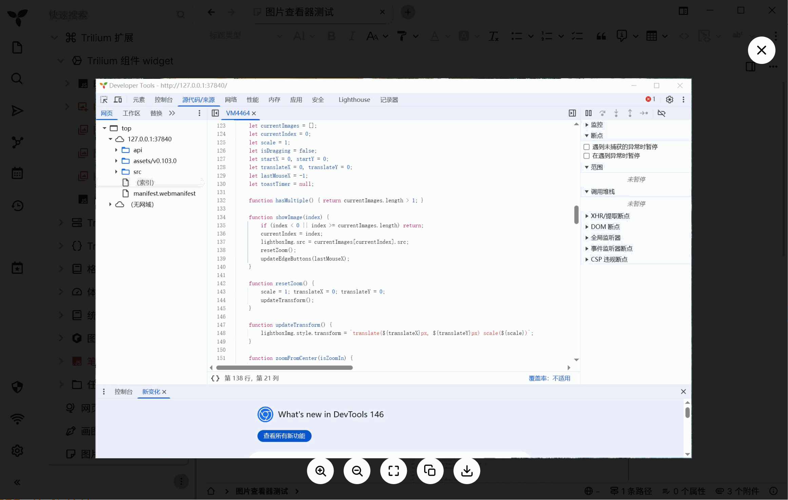

# Trilium Next Image Lightbox

> Trilium Next 图片灯箱查看器：双击笔记中的图片，即可进入全屏查看、缩放、切换、复制、导出和查看图片信息。

## 功能更新 / Feature Highlights

### 1. 双击打开图片灯箱 / Double-click to Open

双击笔记中的图片即可进入全屏灯箱查看器，避免单击图片时误触。

Double-click an image in a note to open the full-screen lightbox viewer, reducing accidental triggers from normal clicks.

### 2. 当前笔记内图片切换 / Navigate Images in Current Note

自动收集当前笔记内的图片，支持上一张 / 下一张切换。鼠标靠近画面左右边缘时显示切换按钮。

Automatically collects images in the current note and supports previous / next navigation. Navigation buttons appear when the cursor moves near the left or right edge.

### 3. 首张 / 末张边界提示 / Boundary Toast

到达第一张或最后一张图片时，不会循环跳转，而是显示 1 秒提示。

When reaching the first or last image, the viewer shows a 1-second toast instead of looping unexpectedly.

### 4. 缩放、复位与拖拽 / Zoom, Reset, and Drag

底部工具栏支持放大、缩小、复位；图片放大后可以拖拽查看细节。

The bottom toolbar supports zoom in, zoom out, and reset. After zooming, the image can be dragged to inspect details.

### 5. 复制与导出图片 / Copy and Export

支持将图片复制到剪贴板，也支持导出图片文件。复制 / 导出前会等待当前图片加载完成，避免空白图片或切错图。

Supports copying images to the clipboard and exporting them as files. The script waits for the current image to load before copy / export to avoid blank or stale images.

### 6. 右键菜单 / Context Menu

在灯箱图片上右键可打开菜单，快速执行复制、另存为、查看图片信息和打开设置。

Right-click the image in the lightbox to open a menu for copy, save as, image info, and settings.

### 7. 图片信息弹窗 / Image Info Dialog

可查看图片名称、类型、大小、尺寸、修改时间和位置。图片大小与修改时间优先通过 `HEAD` 请求获取，并在需要时自动降级。

Shows image name, type, size, dimensions, modified time, and location. Size and modified time are fetched with a `HEAD` request first, with fallback when needed.

### 8. 多语言设置 / Multilingual UI

内置中文、English、日本語，并将运行期语言选择保存到 `localStorage`。

Includes Chinese, English, and Japanese UI. Runtime language selection is saved in `localStorage`.

## 中文说明

### 安装方法

1. 打开 Trilium Next。
2. 创建或打开一个前端 JavaScript 脚本笔记。
3. 将 `trilium-lightbox-v3.js` 的内容粘贴进去。
4. 确认该脚本笔记启用于前端。
5. 刷新或重启 Trilium Next。
6. 双击笔记里的图片即可打开查看器。

### 注意事项

复制图片到剪贴板需要安全上下文：桌面版、localhost 或 HTTPS 通常可用；普通 HTTP 页面可能会被浏览器限制。

图片大小和修改时间依赖服务器返回的响应头。如果服务器没有提供，对应字段会显示为未知。

---

## English

### Installation

1. Open Trilium Next.
2. Create or open a frontend JavaScript script note.
3. Paste the contents of `trilium-lightbox-v3.js` into that script note.
4. Make sure the script note is enabled for the frontend.
5. Refresh or restart Trilium Next.
6. Double-click an image in a note to open the viewer.

### Notes

Clipboard image copy requires a secure context. It should work in the desktop app, localhost, or HTTPS. Plain HTTP pages may be blocked by the browser.

Image size and modified time depend on response headers returned by the server. If the server does not provide them, the dialog will show them as unknown.

## License

MIT
